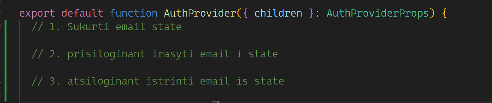
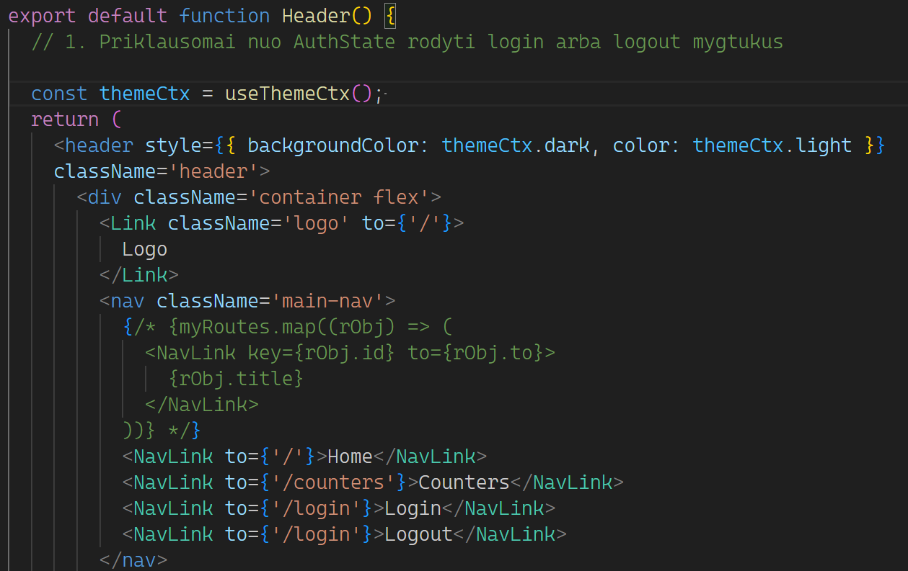
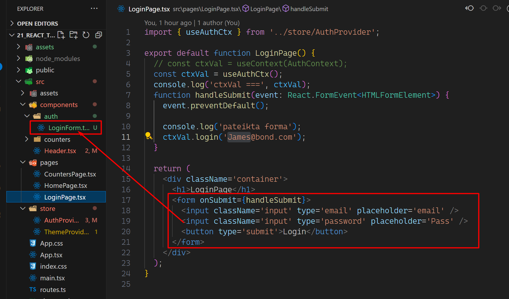

## Praktika

1. Auth provider 
2. Header auth 
3. Iskelti forma i atskira komponenta 

   3.1 LoginForm componente surinkti reiksmes is inputu i state ir pateikiant forma perduoti i LoginPage komponenta. pats formos handleSubmit lieka LoginPage
